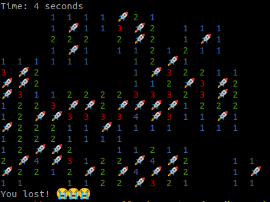

# Minesweeper

Simple implementation of minesweeper in NodeJS (TypeScript).

Running in console:

## How to run this

1. Install NodeJS
2. Clone this repo
3. Run `npm install`
4. Run `npm run start` in the terminal.

## How to play

Use ⬅️ ⬆️ ⬇️ ➡️ to move the cursor and press ⏎ to select a cell.

Use 'f' to flag a cell.

Use 'space' to reveal a cell.